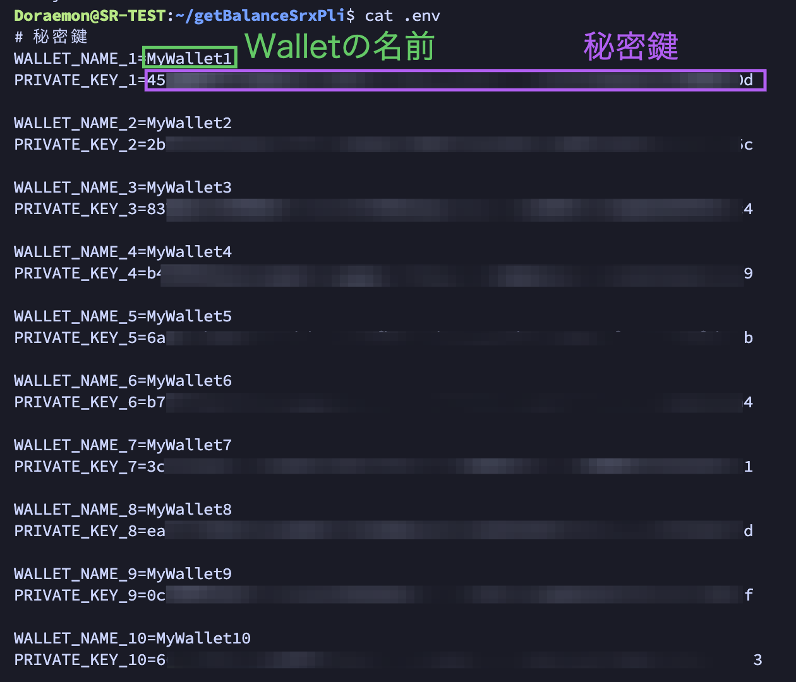

これは、SRXノードを使っている方向けのリポジトリです。私、11ppmが自分用に作成したものを、皆さんのお役に立てるのならばと公開します。

できることは、大きく2つです。

1. SRXノードの報酬を受け取る各WalletのXDCとSRXの残高を取得し、csvファイルで出力します。
2. SRXノードの報酬SRXを受け取った複数のWalletを1つのWalletに送金します。
3. PLIノードでも同じように使えるようにしてます。

## ひとりごと

- StorX Node ($SRX) を複数台所有していると、その分だけWalletが必要になります。また時々、報酬として受け取ったSRXの残高をWallet毎に確認をしたり、散らばったSRXを１つにまとめたりしたくなります。その時にちょっと便利なスクリプトをご用意しました。

- 残高を確認するだけならばアドレスがあれば可能ですが、送金には秘密鍵が必要になります。そのため秘密鍵を用意しなくてはなりません。だからとても危険です。良い子は扱わないでください。でも便利なので、私は使います。

- 私は30台のSRXノードを持っています（告白！）。そして30台のノード報酬が30個Walletに入るわけですが、それらを1つのコマンドで1つのWalletにまとめて送金します。その結果、29個のWalletのSRX残高は0になります。これでかなり扱いが楽になりました。

- 私はPluginノードでも、これを使っています。sourceとして、PLIのjsonファイルも入れておきました。もしちょっと触ってみたいという方は、こちらも試してみてください。ただし自己責任です！

## 注意１　秘密鍵を扱いますので、大変危険です
## 注意２　自信のない方は絶対に使わないで下さい
## 注意３　あくまで自己責任！私、責任追いません！

<br>
<p>

## 1. リポジトリをコピー
```
cd && git clone https://github.com/11ppm/getBalanceSRX
cd ~/getBalanceSRX
```

## 2. 実行環境の確認

- Ubuntuで`Node.js`と`npm`がインストールされている必要があります。それを確認するには、ターミナルで以下のコマンドを実行してください。
- Pluginノードには、入っています。またSRXノードには入っていません。いずれにせよ本番機ではせずに、テスト機を使うようにしてください。

```
node -v
npm -v
```

- `Node.js`がインストールされていない場合は、以下のコマンドを実行します。

```
sudo apt update && sudo apt install nodejs npm -y 
```

## 3. npmパッケージをインストール

- `xdc3`と`dotenv`という二つのnpmパッケージをインストールします。
```
npm install xdc3 dotenv
```

## 4. .envを編集
- XDCWalletの秘密鍵を記入します。とりあえず`PRIVATE_KEY_1`から`PRIVATE_KEY_10`まで書いています。必要な数だけ増減して記入してください。秘密鍵が記入されていない場合は、スルーされます。
- 複数ウォレットから１つのウォレットに送金する宛先・ウォレットアドレス`YOUR_RECIPIENT_WALLET_ADDRESS`を記入してください。アドレスの頭は、xdcから始まって結構です。



## 5. 実行コマンド

### WalletのXDCとSRX（or PLI）の残高を確認する
- csvファイルとして同じディレクトリに出力します。
  
---
- SRXバージョン
```
node getBalances_Srx.js
```

- PLIバージョン
```
node getBalances_Pli.js
```

### 複数WalletにあるSRX（or PLI）を、1つのアドレスにまとめて送金する
- `.env`の`RECIPIENT_ADDRESS=YOUR_RECIPIENT_WALLET_ADDRESS`は、送金先のアドレスを入力してください。
- 例. RECIPIENT_ADDRESS=xdc15263748....
---
- SRXバージョン
```
node sendSrxToOneAddress.js
```

- PLIバージョン
```
node sendPliToOneAddress.js
```


## 6. （重要）`.env`の削除
- 実行した後は、必ず`.env`を削除してください。
```
rm .env
```
- `.env`の中身は、次のコマンドで見ることができます。それをコピーしておいて、ローカル（PCのメモ帳など）に記して、保管しておくこともできます。その時も、保管は厳重にしてください。
```
cat .env
```
- 次回以降、同じものを使いたい時には、`nano .env`で、貼り付けてください。保存は、
```
nano .env
```
#### nanoエディタでの保存手順
nano で編集したファイルを保存する方法は、次の手順に従ってください：
1. キーボードで `"Ctrl"` キーと `"X"` キーを同時に押します。
1. キーボードで `"Y"` キーを押して変更を保存することを確認します。
1. キーボードで `"Enter"` キーを押してエディターを終了します。
これらの手順により、編集したファイルの変更が保存され、nanoエディターが終了します。
  

